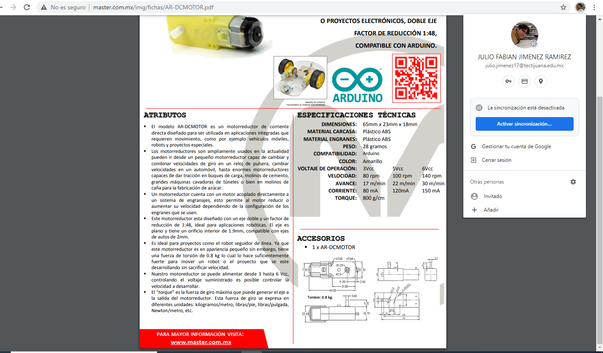

# Actuadores

## :trophy: A.2.1 Actividad de aprendizaje

**Tipos de actuadores eléctricos comerciales**

### :blue_book: Instrucciones

1. Cada equipo deberá elaborar su presentación de acuerdo con el modelo del actuador eléctrico que el asesor le indique.
2. Los temas deberán exponerse en clase por todos los integrantes evitando que se perciba la lectura del documento.
3. El tiempo máximo de la presentación deberá ser no mayor a 8 minutos.
4. La actividad será redactada utilizando el estilo ***markdown***.
5. El documento deberá incluir, los elementos indicados en la **rubrica** tales como son portada, introducción, desarrollo, conclusiones e información bibliográfica o enlaces utilizados.
6. El desarrollo deberá incluir características físicas y eléctricas, esquemático, usos aplicativos,  imágenes del actuador, asi como cualquier otra información que considere importante y que le pueda apoyar en el desarrollo de la exposición.
7. El documento deberá contar con la nomenclatura **A2.1_NombreApellido_Equipo**, y se deberá subir a la plataforma classroom en formato PDF dentro del apartado correspondiente a la actividad.
8. El documento elaborado para desarrollar la actividad será compartido en la plataforma colaborativa **GitHub**, dando acceso al asesor para su revisión.

### :pencil2: Desarrollo

1. Utilice el siguiente listado de modelos de actuadores electricos comerciales, para elaborar su actividad de acuerdo con las instrucciones solicitadas por el asesor.

   - [x] [Motor reductor de doble eje](https://articulo.mercadolibre.com.mx/MLM-651722486-motor-reductor-de-doble-eje-recto-3-vcc-mot-120-_JM?quantity=1#position=3&type=item&tracking_id=36396cb4-7b75-41a3-97e3-a0c6af6709c3) 
   - [ ] [Motor Unipolar paso a paso](https://articulo.mercadolibre.com.mx/MLM-587352935-motor-a-pasos-pm55l-048-unipolar-75-por-paso-con-cables-_JM?quantity=1#position=3&type=item&tracking_id=1a7ba1b9-b483-4d15-889f-2b970c4779c2) 
   - [ ] [Motor Bipolar paso a paso](https://articulo.mercadolibre.com.mx/MLM-783827003-motores-a-pasos-nema-23-bipolar-13kg-minebea-japones-arduino-_JM?quantity=1#position=2&type=item&tracking_id=f05c36d1-e3e0-4d19-b76e-8bbd132124fd) 
   - [ ] [Servomotor modelo SG90](https://articulo.mercadolibre.com.mx/MLM-618694358-micro-servomotor-sg90-robotica-arduino-16-kg-servo-motor-_JM?quantity=1&variation=23651072471#position=1&type=item&tracking_id=4b156b79-3721-4fc1-9ef0-4f378d92e1ef)

2. Espere a que el asesor le indique que tipo de sensor sera el que desarrollara su equipo y una vez que tenga marque el sensor dentro del punto anterior.
3. Una vez que conoce el tema a desarrollar, investigue y redacte dentro de este documento los puntos siguiente:

[presentacion/documento](https://github.com/JDavidDiaz/Sistemas-Programables/blob/master/Docs/A2.1_TheChallengers.pdf)

4. Inserte imágenes de **evidencias** tales como son reuniones  de los integrantes del equipo realizadas para el desarrollo de la actividad

.png)

1. Incluya las conclusiones individuales y resultados observados durante el desarrollo de la actividad.

Jorge Diaz  
Con el desarrollo de esta práctica nos podemos dar cuenta de las utilidades que puede ofrecer un motorreductor en general. Estos motores usan engranajes ensamblados para ayudar a reducir la velocidad, útiles para aplicaciones que necesiten mucha fuerza para mover objetos pesados además de sus notables ventajas como la simplificación de su diseño y la implementación de sus engranajes ayudando a reducir costos a comparación de otros tipos de motores que están diseñados con el motor y los engranajes por separado.

Jiménez Ramírez   
En conclusión, los motores de doble eje tienen aplicaciones diversas aplicaciones, pero lo que resalta es la diferencia que tiene por tener dos ejes y para que sirve, ya puede ser conducir dos aplicaciones en cada lado del motor o montar el otro lado para algún codificador. Que al final esta característica es lo que lo hace tan especial.

Gonzalez Ochoa  
Con la investigación realizada nos podemos dar cuenta del funcionamiento y la utilidad de este motorreductor. En que se puede aplicar precisamente del que se habla en la práctica y los usos que pueden tener motorreductores de diferentes tamaños, desde el más pequeño hasta los más grandes. Este precisamente permite colocar un codificador para la realización de proyectos que tengan que ver con la robótica.

## Bibliografia

Shopmaster.com, Información básica y funcionamiento del motor   
https://shop.master.com.mx/product/detail?id=7677&fbclid=IwAR3PQjVZpYBgUKSk7gVntztYlUMyUM8D7PqP0vMfaEn_cTTbCGEdBtRT7L0

### :bomb: Rubrica

| Criterios     | Descripción                                                                                  | Puntaje |
| ------------- | -------------------------------------------------------------------------------------------- | ------- |
| Instrucciones | Se cumple con cada uno de los puntos indicados dentro del apartado Instrucciones?            | 10      |  | 5 |
| Desarrollo    | Se respondió a cada uno de los puntos solicitados dentro del desarrollo de la actividad?     | 60      |
| Demostración  | El alumno se presenta durante la explicación de la funcionalidad de la actividad?            | 20      |
| Conclusiones  | Se incluye una opinión personal de la actividad  por cada uno de los integrantes del equipo? | 10      |

:house: [Ir a Github](https://github.com/JDavidDiaz/Sistemas-Programables)