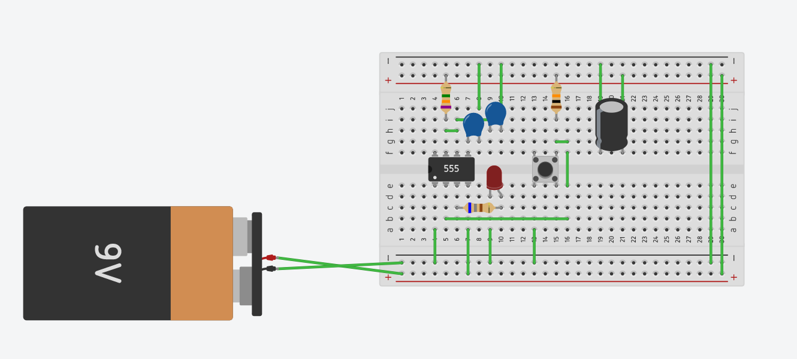
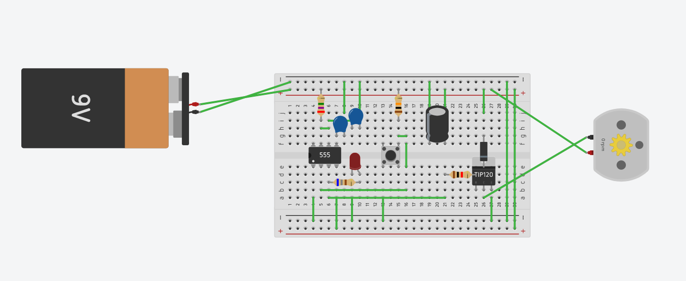
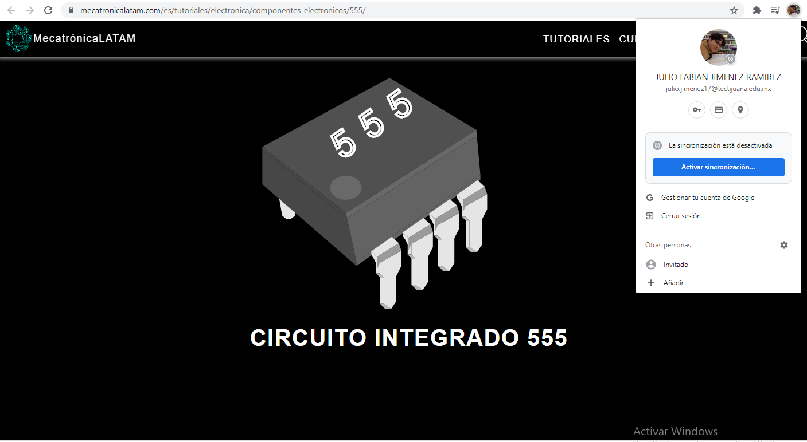
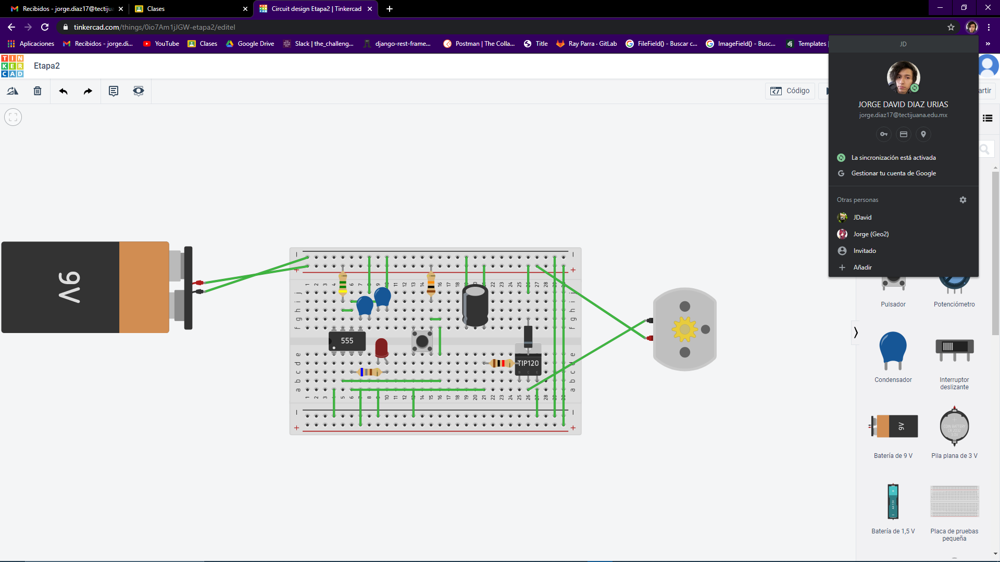
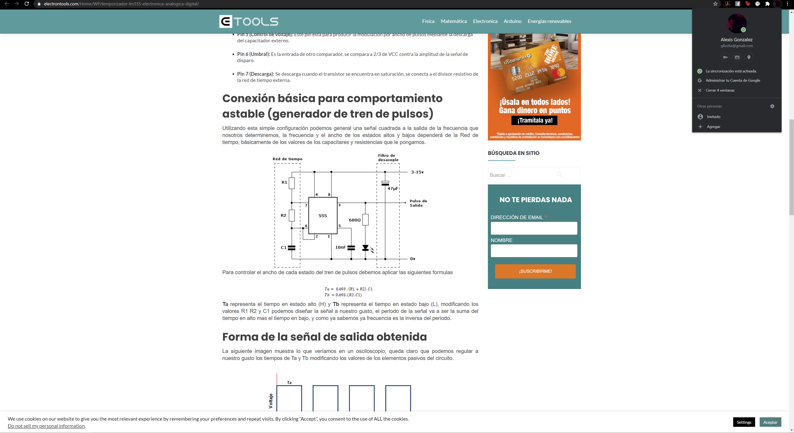

# Actuadores

# :trophy: A.2.2 Actividad de aprendizaje

 Realizar un sistema de control de arranque y encendido para un actuador eléctrico a través de un circuito electrónico, utilizando un simulador, un **Temporizador NE55s** y un **Motor de DC**.

___

### :blue_book: Instrucciones

- Se sugiere para el desarrollado de la presenta actividad, utilice uno de los siguientes simuladores: [Autodesk Tinkercad](https://www.tinkercad.com/), [Virtual BreadBoard](http://www.virtualbreadboard.com/), [Easy EDA](https://easyeda.com/) por lo cual habrá que familiarizarse antes, e incluso instalarse o registrarse dentro de la plataforma.
- Toda actividad o reto se deberá realizar utilizando el estilo **MarkDown con extension .md** y el entorno de desarrollo VSCode, debiendo ser elaborado como un documento **single page**, es decir si el documento cuanta con imágenes, enlaces o cualquier documento externo debe ser accedido desde etiquetas y enlaces, y debe ser nombrado con la nomenclatura **A2.2_NombreApellido_Equipo.pdf.**
- Es requisito que el .md contenga una etiqueta del enlace al repositorio de su documento en GITHUB, por ejemplo **Enlace a mi GitHub** y al concluir el reto se deberá subir a github.
- Desde el archivo **.md** exporte un archivo **.pdf** que deberá subirse a classroom dentro de su apartado correspondiente, sirviendo como evidencia de su entrega, ya que siendo la plataforma **oficial** aquí se recibirá la calificación de su actividad.
- Considerando que el archivo .PDF, el cual fue obtenido desde archivo .MD, ambos deben ser idénticos.
- Su repositorio ademas de que debe contar con un archivo **readme**.md dentro de su directorio raíz, con la información como datos del estudiante, equipo de trabajo, materia, carrera, datos del asesor, e incluso logotipo o imágenes, debe tener un apartado de contenidos o indice, los cuales realmente son ligas o **enlaces a sus documentos .md**, _evite utilizar texto_ para indicar enlaces internos o externo.
- Se propone una estructura tal como esta indicada abajo, sin embargo puede utilizarse cualquier otra que le apoye para organizar su repositorio.
  
```
- readme.md
  - blog
    - C2.1_TituloActividad.md
    - C2.2_TituloActividad.md
  - img
  - docs
    - A2.1_TituloActividad.md
    - A2.2_TituloActividad.md
```
___

### :pencil2: Desarrollo

1.Utilice el siguiente listado de materiales para la elaboración de la actividad

| Cantidad | Descripción                            | Fuentes         |
| -------- | -------------------------------------- | --------------- |
| 1        | Circuito integrado LM555               |[mecatronica latam](https://www.mecatronicalatam.com/es/tutoriales/electronica/componentes-electronicos/555/) |
| 1        | Capacitor electrolítico de 47uf        | [geekbotelectronics](http://www.geekbotelectronics.com/producto/capacitor-electrolitico-50-v/)|
| 1        | Condensador cerámico de 10nf           | [hetpro-store](https://hetpro-store.com/TUTORIALES/capacitor/)|
| 1        | Fuente de voltaje de 9V                |[unicrom](https://unicrom.com/fuente-de-voltaje-5-y-9-vdc/) |
| 1        | Transistor de poder TIP122             |[sandorobotics](https://sandorobotics.com/producto/tip122/) |
| 1        | Diodo 1N4001 o equivalente             | [330ohms.com](https://www.330ohms.com/products/diodo-rectificador-1n4001)|
| 1        | Mini Motor DC                          | [steren.com.](https://www.steren.com.mx/mini-motor-de-corriente-directa.html)|
| 3        | Resistencias 680,1k,10k Ohmios de 1/4w | [inventable.eu](https://www.inventable.eu/2015/07/24/potencia-resistencias-comunes/)|
| 1        | Pulsador de disparo                    | [bibing.us](http://bibing.us.es/proyectos/abreproy/4768/fichero/02_MEMORIA%252F02_MEMORIA04.pdf)|
| 1        | Diodo Led Rojo                         | [steren.com](https://www.steren.com.mx/led-ultrabrillante-de-5-mm-color-rojo.html)|

1. Utilice el circuito electrónico de la imagen siguiente y ensamble la etapa 1 dentro del simulador.

<p align="center">
    
</p>

2. Como se podrá observar en el circuito anterior existe un area identificada como "Red de tiempo" y otra "Filtro de desacople", **explique el proposito de ambos terminologias**.
   
- **Red de tiempo:** Son los componentes que definen la frecuencia y el ancho de los estados bajos y altos dependen de la resistencia y el condensador que aparecen dentro de la red de tiempo.
- **Filtro de desacople:** Este es un condensador utilizado para desviar las señales de CA de una señal CC, esto para dejarlo más puro. Estos son útiles para limpiar el ruido de una fuente de alimentación CC.
  
3. Continuando con la imagen anterior, observe se muestra la ecuación Ct= 1.1 * R1 * C1, la cual es utilizada para establecer el tiempo de **encendido del pulso de salida**. Basándose en esa ecuación anterior calcule los valores de **R1 y C1** si se desea mantener encendido el pulso de salida, dada las 3 condiciones requeridas en la tabla anexa.

    | Numero | Condición  | Valor de R1 | Valor de C1 |
    | ------ | ---------- | ----------- | ----------- |
    | 1      | 3 segundos | 2.7Mohms    |     10uf    |
    | 2      | 5 segundos | 4.5Mohms    |     10uf    |
    | 3      | 8 segundos | 7.2Mohms    |     10uf    |

3s = 1.1 * R1 * 10uf > R1 = 2.7 Momhs

5s = 1.1 * R1 * 10uf > R1 = 4.5 Mohms

8s = 1.1 * R1 * 10uf > R1 = 7.2Mohms

4. Una vez que se halla completado la tabla anterior, inicie la simulación para cualquiera de las tres condiciones y observe el comportamiento del Led;  **explique su observación**.

- Se puede observar en el circuito que entre mayor valor de resistencia mayor duración de encendido en el LED




5. Ensamble la etapa 2 e integre la terminal del pulso de salida a la entrada de la base del transistor de esta segunda etapa.
   



6. Una vez concluido el paso anterior, elija una de las 3 condiciones registradas en la tabla anterior y observe el comportamiento del motor DC; **explique su observación**.
   
  - De la misma manera como sucede con el LED, la duración del motor es igual que la duración de encendido del led llegando hasta un máximo de 629 rpm en cada una de las condiciones del tiempo.

7. Una vez que el tiempo de encendido del pulso de salida de la etapa 1 se completo, **que sucede con el motor DC? Explique la razon de este comportamiento?**

- El motor deja de girar ya que al estar conectado a la terminal del pulso de salida del temporizador al igual que el LED pero a través de un transistor ya que como el pulsador hace funcionar como interruptor para encender el LED, el transistor lo hace para el motor, el temporizador determina el tiempo duración para ambos componentes
___

8. Conclusiones
   
- Jorge Diaz Con la realización de la práctica se puede observar el funcionamiento del temporizador 555 aplicando cálculos podemos observar el tiempo de duración y al usar las resistencias y capacitores podemos manipular el tiempo que queramos hacer durar el LED o el motor encendidos de acuerdo a los valores de estas resistencias y capacitores, en el caso de esta práctica podemos observar que entre mayor sea el valor de la resistencia será mayor el tiempo de duración en segundos.

- Alexis Gonzalez La práctica sirvió para entender el funcionamiento del temporizador 555 integrado a un circuito, y que manipulando las resistencias y los capacitores podemos variar el tiempo para el LED o el motor, que esa parte del circuito lleva el nombre de “red de tiempo”. Porque mientras aumentemos los valores de la resistencia el tiempo de duración se verá afectado haciendo que también se eleve. Y que el condensador de desacople sirve para desviar el ruido ocasionado por las señales CA purificando la fuente de alimentación CC.

- Julio Jimenez En conclusión se pudo entender el funcionamiento del temporizador 555, aplicando este en el circuito combinado con el led y el motor, que se separan en red de tiempo y fila de desacople. Se observa que su funcionamiento varía a la resistencia y el capacitor, en este caso mantuvimos el capacitor en la mis capacidad eléctrica y cambio la resistencia, entre mayores estos valores mayor tiempo de retraso en el LED.

9. Evidencia 





### :bomb: Rubrica

| Criterios     | Descripción                                                                                  | Puntaje |
| ------------- | -------------------------------------------------------------------------------------------- | ------- |
| Instrucciones | Se cumple con cada uno de los puntos indicados dentro del apartado Instrucciones?            | 10      |
| Desarrollo    | Se respondió a cada uno de los puntos solicitados dentro del desarrollo de la actividad?     | 60      |
| Demostración  | El alumno se presenta durante la explicación de la funcionalidad de la actividad?            | 20      |
| Conclusiones  | Se incluye una opinión personal de la actividad  por cada uno de los integrantes del equipo? | 10      |


:house: [Ir a Github](https://github.com/JDavidDiaz/Sistemas-Programables)